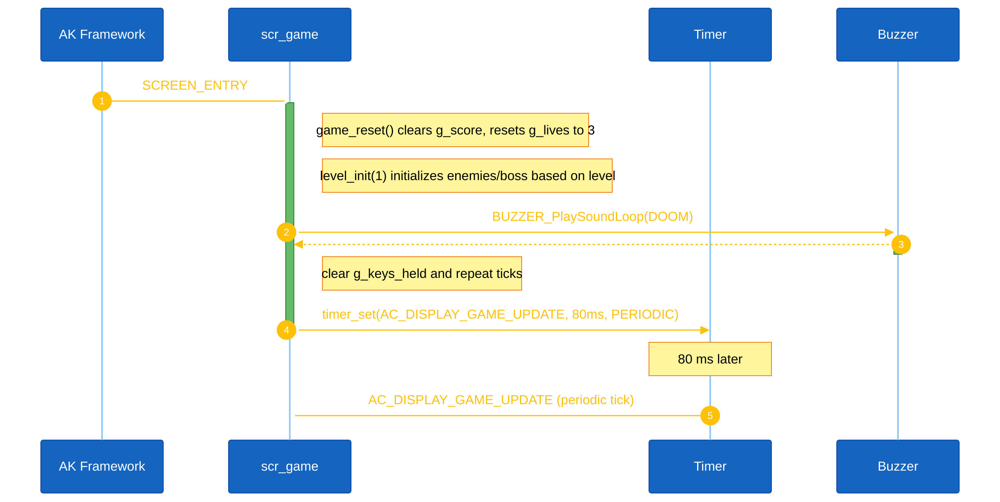
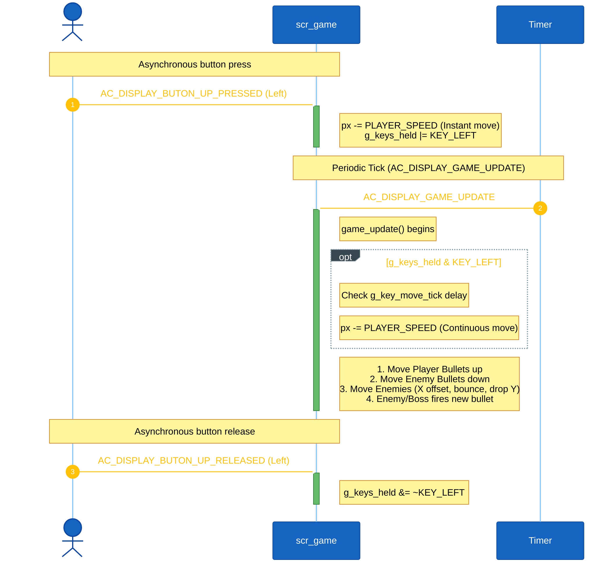
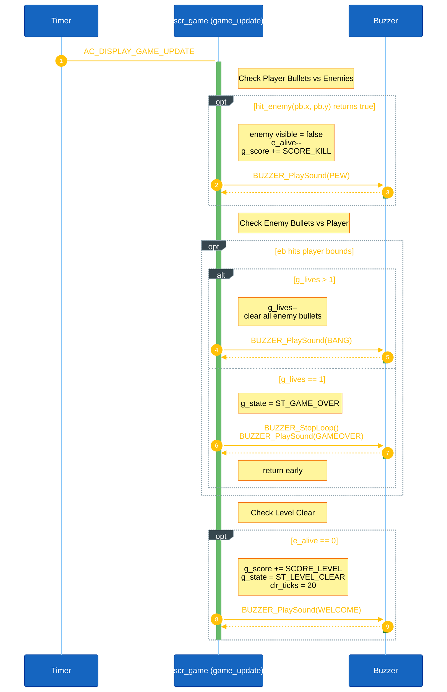

<h1 align="center">Runtime Signal Processing</h1>

This document explains how Alien Shooter processes button input, game-loop ticks, and game object updates. Unlike multi-task designs, Alien Shooter centralizes its gameplay logic inside a single screen handler (`scr_game_handle`) owned by the display task (`AC_TASK_DISPLAY_ID`).

## I. Overview

Alien Shooter runs entirely within the display task. It uses an event-driven loop powered by periodic timers and hardware button signals.

**Key components:**
- **State Data:** All game objects (player, bullets, enemies, boss) are stored as static variables inside `scr_game.cpp`.
- **Game Tick:** The main loop runs on the `AC_DISPLAY_GAME_UPDATE` signal.
- **Interval:** The game tick interval is defined by `AC_DISPLAY_GAME_UPDATE_INTERVAL` (80 ms).
- **Input:** Hardware button callbacks post `AC_DISPLAY_BUTON_*` signals directly to the display task.

Main runtime flow:
1. `SCREEN_ENTRY` initializes the game state, plays the background music, and arms the periodic timer.
2. Button callbacks post asynchronous `PRESSED` and `RELEASED` signals. The screen updates the player position instantly and latches the state into `g_keys_held` for smooth continuous movement.
3. Every 80ms, the `AC_DISPLAY_GAME_UPDATE` signal triggers `game_update()`.
4. `game_update()` processes continuous movement, moves bullets, updates enemies/boss, resolves collisions, and checks for level transitions or game over.
5. The view renderer (`view_scr_game()`) reads the updated static variables and draws the new frame to the OLED.

---

## II. Game Start & Initialization

When the screen transitions to the game screen, the framework posts a `SCREEN_ENTRY` signal to `scr_game_handle()`.

<strong><em>Figure 1:</em></strong> Game start sequence logic

---

## III. Gameplay Loop & Input Handling

Input handling in Alien Shooter uses a hybrid approach:
- **Instant Response:** Pressing a button instantly applies movement or shoots a bullet.
- **Continuous Response:** Holding a button latches a bit in `g_keys_held`. The periodic `game_update()` reads this mask and applies repeated movement (`KEY_REPEAT_MOVE_TICKS`) or continuous shooting (`KEY_REPEAT_SHOOT_TICKS`) if enough ticks have passed.

<strong><em>Figure 2:</em></strong> Input and gameplay loop logic

---

## IV. Collision, Level Clear, and Game Over

All object state updates are processed synchronously within `game_update()`.
- **Enemy hit:** When a player bullet intersects an enemy, `hit_enemy()` hides the enemy, increases the score, and plays a sound.
- **Player hit:** When an enemy bullet hits the player, `g_lives` is decremented. If `g_lives` drops to 0, `g_state` switches to `ST_GAME_OVER`.
- **Level Clear:** Checked at the end of `game_update()`. If `e_alive == 0`, `g_state` switches to `ST_LEVEL_CLEAR`, granting a score bonus and starting a countdown timer before loading the next level.

<strong><em>Figure 3:</em></strong> Collision and state transition logic

---

## V. Code References

| Logic Area | Location in `scr_game.cpp` |
|---|---|
| Screen Handler (Signal Routing) | `scr_game_handle()` |
| Game Update Loop | `game_update()` |
| Initialization / Next Level | `level_init()` |
| Player Bullet Firing | `do_shoot()` |
| Enemy Bullet Firing | `enemy_shoot_one()`, `boss_shoot()` |
| Collision Detection | `hit_enemy()` |
| Rendering (OLED Drawing) | `view_scr_game()`, `draw_enemy()`, `draw_boss()` |

All game logic operates inside `application/sources/app/screens/scr_game.cpp`. No custom RTOS tasks are needed for individual game objects.
